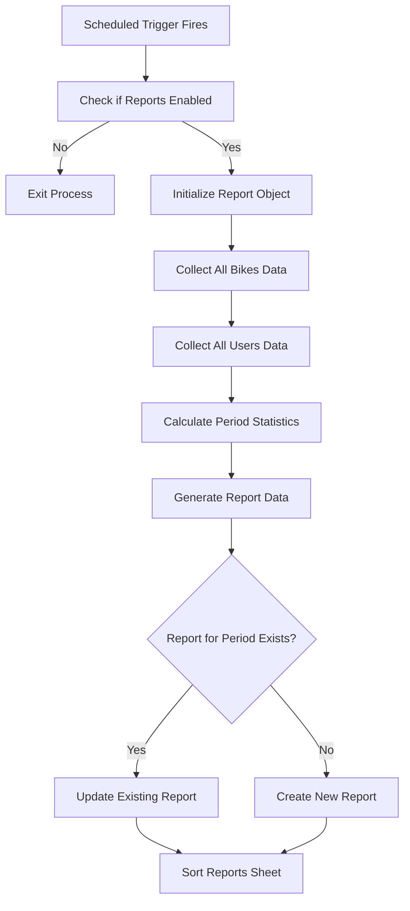

# BikeShare System - Documentation

## Table of Contents
1. [System Overview](#system-overview)
2. [Architecture & Design](#architecture--design)
3. [Core Classes & Components](#core-classes--components)
4. [Database Schema](#database-schema)
5. [User Interface & Forms](#user-interface--forms)
6. [Workflow Processes](#workflow-processes)
7. [Configuration & Settings](#configuration--settings)
8. [Communication System](#communication-system)
9. [Testing & Utilities](#testing--utilities)
10. [Deployment & Setup](#deployment--setup)
11. [API Reference](#api-reference)

---

## System Overview

The **BikeShare System** is a comprehensive bike rental management platform built on Google Apps Script that leverages G-Suite automation for streamlined bike checkouts, returns, and inventory management. The system uses Google Sheets as a database backend and Google Forms for user interaction, providing a complete solution for educational institutions or organizations managing a fleet of shared bicycles.

### Key Features
- **Automated Bike Checkout/Return Processing**: Real-time form submission handling with validation
- **User Management**: Comprehensive tracking of user history, usage patterns, and compliance
- **Bike Inventory Management**: Complete bike lifecycle tracking with maintenance status
- **QR Code Integration**: Each bike has a unique hash ID and QR code for easy checkout
- **Automated Reporting**: Periodic system snapshots
- **Communication System**: Email notifications for users, admins, and developers
- **Error Handling**: Comprehensive error management with color-coded entry marking
- **Friend Return Feature**: Users can return bikes on behalf of others
- **Overdue Tracking**: Automatic detection and reporting of late returns
- **Maintenance Management**: Bike condition tracking and repair status management

---

## Architecture & Design

### Object-Oriented Programming Structure
The system follows OOP principles with clear separation of concerns:

```
                    ┌─────────────────────────┐
                    │    CACHED_SETTINGS      │
                    │   (Global Settings)     │
                    │   ┌─────────────────┐   │
                    │   │   Settings      │   │
                    │   │     Class       │   │
                    │   └─────────────────┘   │
                    └───────────┬─────────────┘
                                │ provides config to
                                ▼
┌─────────────────────────────────────────────────────────────────┐
│                    BikeShareService                             │
│                  (Main Orchestrator)                            │
│  ┌─────────────┐    ┌─────────────────┐    ┌──────────────────┐│
│  │     db      │    │      comm       │    │   Uses Settings  ││
│  │(DatabaseMgr)│    │ (Communicator)  │    │   for all ops    ││
│  └─────────────┘    └─────────────────┘    └──────────────────┘│
└─────────────────┬─────────────┬─────────────────────────────────┘
                  │             │
        ┌─────────┼─────────────┼─────────┐
        │         │             │         │
   ┌────▼───┐ ┌───▼───┐     ┌───▼─────────┐
   │ User   │ │ Bike  │     │DatabaseManager│
   │        │ │       │     │              │
   │ ┌────┐ │ │┌────┐ │     │  ┌─────────┐ │
   │ │ db │ │ ││ db │ │     │  │manages  │ │
   │ │comm│ │ ││comm│ │     │  │all data │ │
   │ └────┘ │ │└────┘ │     │  │ sheets  │ │
   └────┬───┘ └───┬───┘     └─────────────┘
        │         │         
   ┌────▼────┐ ┌──▼──────────┐ 
   │CheckoutLog│ │   Report    │ 
   │         │ │             │ 
   │ ┌─────┐ │ │ ┌─────────┐ │ 
   │ │ db  │ │ │ │   db    │ │ 
   │ │comm │ │ │ │  bikes  │ │ 
   │ └─────┘ │ │ │  users  │ │ 
   └─────────┘ │ └─────────┘ │ 
               └─────────────┘ 
   ┌─────────┐                  ┌─────────────┐
   │ReturnLog│                  │Communicator │
   │         │                  │             │
   │ ┌─────┐ │                  │ ┌─────────┐ │
   │ │ db  │ │                  │ │   db    │ │
   │ │comm │ │                  │ │ Gmail   │ │
   │ └─────┘ │                  │ │MarkEntry│ │
   └─────────┘                  │ └─────────┘ │
                                └─────────────┘

Legend:
├── Composition/Ownership relationship
├── Dependencies (uses services of)
└── Inheritance/Extension relationship
```

### System Components

1. **Main Dashboard Spreadsheet**: Central data storage with multiple sheets
2. **Management Spreadsheet**: Configuration and settings management
3. **Google Forms**: User interfaces for checkout and return processes
4. **Apps Script**: Server-side logic and automation
5. **Email Integration**: Automated notifications via Gmail API
6. **QR Code System**: Unique identifiers for each bike

---

## Core Classes & Components

### 1. BikeShareService (Main Orchestrator)
**Location**: `BikeShareService.js`

The central service class that coordinates all system operations.

```javascript
class BikeShareService {
  constructor(spreadsheetID)
  processCheckout(formResponse, range)
  processReturn(formResponse, range) 
  generatePeriodicReport()
  calculateUsageHours(bikeName)
  manageFormsAccessibility(action)
}
```

**Key Responsibilities**:
- Form submission processing
- User and bike interaction coordination
- Report generation orchestration
- System accessibility management

### 2. DatabaseManager (Data Access Layer)
**Location**: `DatabaseManager.js`

Handles all Google Sheets database operations with a unified interface.

```javascript
class DatabaseManager {
  constructor(spreadsheetId)
  getSheet(sheetName)
  getAllData(sheetName)
  findRowByColumn(sheetName, columnIndex, value)
  updateRow(sheetName, rowIndex, values)
  appendRow(sheetName, values)
  sortByColumn(sheet, sheetName)
  resetDatabase()
  markEntry(range, bgColor, note)
}
```

**Features**:
- Fuzzy matching for data lookup
- Automatic sheet sorting
- Database reset functionality
- Entry marking for visual feedback

### 3. User (User Management)
**Location**: `User.js`

Represents system users with comprehensive tracking capabilities.

```javascript
class User {
  constructor(userEmail)
  static findByEmail(userEmail)
  checkoutBike(commContext)
  returnBike(commContext)
  checkIfReturningForFriend(returnLog)
  save()
}
```

**User Attributes**:
- Email address (unique identifier)
- Unreturned bike status
- Checkout/return history
- Usage statistics
- Mismatch tracking
- Overdue return counts

### 4. Bike (Inventory Management)
**Location**: `Bike.js`

Represents individual bikes with status and operational methods.

```javascript
class Bike {
  constructor(bikeName, bikeHash, size, maintenanceStatus, availability)
  static findByName(bikeName)
  static findByHash(bikeHash)
  checkout(commContext)
  returnBike(commContext)
  updateRecentUsers(newUser)
  isOverdue(maxHours)
  isReadyForCheckout()
}
```

**Bike Attributes**:
- Unique name and hash ID
- Size classification (S, M, L, XL)
- Maintenance status
- Availability status
- Usage tracking
- Recent user history

### 5. Communicator (Notification System)
**Location**: `Communicator.js`

Manages all system communications including emails and visual feedback.

```javascript
class Communicator {
  constructor(spreadsheetID)
  handleCommunication(commID, context)
  notifyUser(userEmail, subject, body)
  notifyAdmin(subject, body)
  notifyDeveloper(subject, body)
  markEntry(range, color, note)
}
```

**Communication Features**:
- Template-based email notifications
- Multi-recipient support (user, admin, developer)
- Visual entry marking with color codes
- Context variable substitution

### 6. Report (Analytics & Reporting)
**Location**: `Report.js`

Generates comprehensive system snapshots and analytics.

```javascript
class Report {
  constructor()
  generate()
  save(reportData)
  getAllBikes()
  getAllUsers()
  getPeriodNumber()
  countNewUsersForPeriod()
  countReportedIssuesFromUsers()
}
```

**Report Metrics**:
- Total bikes and availability breakdown
- User statistics and new registrations
- Usage hours and patterns
- Maintenance issues and overdue returns
- Mismatch tracking

---

## Database Schema

The system uses Google Sheets as a relational database with the following structure:

### Bikes Status Sheet
| Column | Field Name | Type | Description |
|--------|------------|------|-------------|
| A | Bike ID | String | Unique bike identifier |
| B | Size | Dropdown | S, M, L, XL |
| C | Maintenance Status | Dropdown | Good, Has Issue, In Repair |
| D | Availability | Dropdown | Available, Checked Out, Out of Service |
| E | Last Checkout Date | Date | Timestamp of last checkout |
| F | Last Return Date | Date | Timestamp of last return |
| G | Current Usage Timer | Number | Hours since checkout |
| H | Total Usage Hours | Number | Cumulative usage |
| I | Most Recent User | Email | Last user email |
| J | 2nd Recent User | Email | Second to last user |
| K | 3rd Recent User | Email | Third to last user |
| L | TempRecent (Hidden) | Email | Temporary storage for user rotation |
| M | Hash-ID (Hidden) | String | Unique 6-character hash for QR codes |
| N | URL Link (Hidden) | URL | Pre-filled checkout form link |
| O | QR Code (Hidden) | Image | Generated QR code image |

### User Status Sheet
| Column | Field Name | Type | Description |
|--------|------------|------|-------------|
| A | Email | Email | Unique user identifier |
| B | Has Unreturned Bike | Yes/No | Current checkout status |
| C | Last Checkout Name | String | Name of last checked out bike |
| D | Last Checkout Date | Date | Timestamp of last checkout |
| E | Last Return Name | String | Name of last returned bike |
| F | Last Return Date | Date | Timestamp of last return |
| G | # of Checkouts | Number | Total checkout count |
| H | # of Returns | Number | Total return count |
| I | # of Mismatches | Number | Return/checkout mismatches |
| J | # of Usage Hours | Number | Total usage time |
| K | # of Overdue Returns | Number | Late return count |
| L | First Usage Date | Date | Date of first system use |

### Checkout Logs Sheet
| Column | Field Name | Type | Description |
|--------|------------|------|-------------|
| A | Timestamp | Date | Form submission time |
| B | Email Address | Email | User email from form |
| C | Scanned Bike Hash-ID | String | QR code scan result |
| D | Key Available Confirmation | Text | Pre-checkout verification |
| E | Condition Confirmation | Text | Bike condition confirmation |

### Return Logs Sheet
| Column | Field Name | Type | Description |
|--------|------------|------|-------------|
| A | Timestamp | Date | Form submission time |
| B | Email Address | Email | User email |
| C | Enter Bike Name | String | User-entered bike name |
| D | Confirm Bike Name | String | Confirmation field |
| E | Rode Correct Bike | Text | Verification question |
| F | Mismatch Explanation | Text | If bike mismatch occurred |
| G | Returning for Friend | Yes/No | Friend return indicator |
| H | Friend Name/Email | Text | Friend identifier |
| I | Issues/Concerns | Text | Reported problems |

### Reports Sheet
| Column | Field Name | Type | Description |
|--------|------------|------|-------------|
| A | Timestamp | Date | Report generation time |
| B | Recorded By | String | Report creator (automated) |
| C | Period | Number | Period number since start |
| D | Total # of Bikes | Number | Total bike count |
| E | Total # of Bikes in Repair | Number | Bikes needing maintenance |
| F | # of Checked Out | Number | Currently checked out |
| G | # of Overdue Bikes | Number | Past due returns |
| H | Available Bikes | Number | Ready for checkout |
| I | New Users | Number | New users this period |
| J | Late Returners | Number | Overdue returns this period |
| K | # of Return Mismatches | Number | Mismatches this period |
| L | Emails with Mismatches | Text | Users with mismatches |
| M | # of Reported Issues | Number | Issues reported this period |
| N | Total # of Usage Hours | Number | Usage hours this period |
| O | Admin Notes | Text | Manual notes field |

---

## User Interface & Forms

### Main Dashboard Spreadsheet Structure

The main dashboard consists of five primary sheets that administrators use to monitor the system:

#### 1. Bikes Status Dashboard
- **Features**: 
  - Color-coded availability status (Green=Available, various colors for other states)
  - Size indicators with color coding (S, M, L, XL)
  - Clickable QR codes and checkout links
  - Real-time usage tracking
  - Recent user history

#### 2. User Status Dashboard  
- **Features**:
  - User activity summary
  - Checkout/return balance tracking
  - Overdue return flagging
  - Usage statistics per user
  - First-time user identification

#### 3. Checkout Logs Dashboard
- **Purpose**: Real-time checkout transaction log
- **Features**: Chronological checkout history with validation status notes & labels

#### 4. Return Logs Dashboard  
- **Purpose**: Real-time return transaction log
- **Features**: Chronological return history with validation status notes & labels

#### 5. Reports Dashboard
- **Purpose**: Periodic system analytics
- **Features**: Automated snapshots, administrative insights

### Google Forms Integration

#### Checkout Form
- **Access Method**: QR code scanning or direct link
- **Pre-filled Data**: Bike hash ID from QR code

#### Return Form  
- **Manual Entry**: User types bike name twice for confirmation
- **Advanced Features**:
  - Friend return capability
  - Issue reporting
  - Mismatch handling
- **Validation**: Bike name & confirmation matching

---

## Workflow Processes

### Checkout Process Flow

```mermaid
graph TD
    A[User Scans QR Code on Bike] --> B[Opens Pre-filled Checkout Form<br/>with Bike Hash ID]
    B --> C[User Confirms:<br/>✓ Key Available at Front Desk<br/>✓ Bike Condition OK]
    C --> D[User Submits Form]
    D --> E[BikeShareService.processCheckout()]
    E --> F[Create CheckoutLog from Form Response]
    F --> G[Find/Create User by Email]
    G --> H{System Active?}
    H -->|No| I[Send System Offline Error<br/>ERR_OPR_COR_001]
    H -->|Yes| J[User.checkoutBike()]
    J --> K{User Has<br/>Unreturned Bike?}
    K -->|Yes & Not Allowed| L[Send Error: Already Have Bike<br/>ERR_USR_COT_002<br/>Include: unreturned bike name, date]
    K -->|No or Allowed| M[Find Bike by Hash ID]
    M --> N{Bike Found?}
    N -->|No| O[Send Error: Bike Not Found<br/>ERR_USR_COT_003]
    N -->|Yes| P{Bike Ready<br/>for Checkout?}
    P -->|No| Q[Send Error: Bike Not Available<br/>ERR_USR_COT_001<br/>Check: maintenance & availability]
    P -->|Yes| R[Bike.checkout() - Update Status]
    R --> S[Update User Records:<br/>• First usage date if new user<br/>• hasUnreturnedBike = true<br/>• lastCheckoutName & Date<br/>• numberOfCheckouts++]
    S --> T[Send Confirmation Email<br/>CFM_USR_COT_001<br/>"Use key labeled '[BIKE NAME]'<br/>Return within [MAX_HOURS] hours"]
    T --> U[Auto-sort Checkout Logs Sheet]
    
    I --> V[Mark Entry with Error Color]
    L --> V
    O --> V
    Q --> V
```

### Return Process Flow

```mermaid
graph TD
    A[User Opens Return Form] --> B[User Enters:<br/>• Bike Name<br/>• Confirm Bike Name<br/>• Rode Correct Bike?<br/>• Friend Return Info<br/>• Issues/Concerns]
    B --> C[User Submits Form]
    C --> D[BikeShareService.processReturn()]
    D --> E[Create ReturnLog from Form Response]
    E --> F[ReturnLog.validate()]
    F --> G{Bike Names<br/>Match?<br/>(Fuzzy Match)}
    G -->|No| H[Send Error: Names Don't Match<br/>ERR_USR_RET_001]
    G -->|Yes| I[Find/Create User by Email]
    I --> J[Check if Returning for Friend]
    J --> K[Calculate Usage Hours]
    K --> L{System Active?}
    L -->|No| M[Send System Offline Error<br/>ERR_OPR_COR_001]
    L -->|Yes| N[User.returnBike()]
    N --> O[Find Bike by Name]
    O --> P{Bike Found?}
    P -->|No| Q{Fuzzy Match with<br/>User's Last Checkout?}
    Q -->|Yes| R[Use Last Checkout Bike]
    Q -->|No| S[Send Error: Bike Not Found<br/>ERR_USR_RET_002]
    P -->|Yes| T{Returning<br/>for Friend?}
    R --> T
    T -->|Yes| U{User Has<br/>Unreturned Bike?}
    U -->|No| V[Check Friend's Status]
    V --> W{Friend Has<br/>Unreturned Bike?}
    W -->|No| X[Send Error: Friend No Unreturned<br/>ERR_USR_RET_003]
    W -->|Yes| Y[Process Friend Return<br/>• Create friend return log<br/>• Update friend's user record]
    U -->|Yes| Z[Send Error: User Has Unreturned<br/>ERR_USR_RET_006]
    T -->|No| AA{User Has<br/>Unreturned Bike?}
    AA -->|No & First User| BB[Send Error: No Checkout Record<br/>ERR_USR_RET_005]
    AA -->|No & Returning User| CC[Send Error: No Unreturned Bike<br/>ERR_USR_RET_006]
    AA -->|Yes| DD{Bike Name Matches<br/>Last Checkout?}
    DD -->|No| EE[Record Mismatch<br/>• numberOfMismatches++<br/>• Use last checkout bike]
    DD -->|Yes| FF[Direct Return Process]
    EE --> FF
    Y --> FF
    FF --> GG[Calculate & Update:<br/>• Usage hours<br/>• Check if overdue<br/>• Update bike status to Available]
    GG --> HH{Issues Reported?}
    HH -->|Yes| II[Set Bike Maintenance:<br/>"Has Issue"]
    HH -->|No| JJ[Keep Bike Status: "Good"]
    II --> KK{Return Type?}
    JJ --> KK
    KK -->|Friend Return| LL[Send Confirmation to Friend Helper<br/>CFM_USR_RET_003<br/>"Returned bike for friend"]
    KK -->|Direct Return| MM[Send Confirmation to User<br/>CFM_USR_RET_001<br/>"Thank you for returning"]
    KK -->|Mismatch Return| NN[Send Mismatch Confirmation<br/>CFM_USR_RET_004<br/>Include mismatch details]
    LL --> OO[Update User Records & Sort Sheet]
    MM --> OO
    NN --> OO
    
    H --> PP[Mark Entry with Error Color]
    S --> PP
    X --> PP
    Z --> PP
    BB --> PP
    CC --> PP
    M --> PP
```

### Report Generation Process



---

## Configuration & Settings

### Settings Management Architecture

The system uses a centralized configuration management approach with the `Settings` class that caches configurations for optimal performance:

#### Management Spreadsheet Structure

1. **mainConfig Sheet**:
   - **System Buttons**: ON/OFF controls for system operations
   - **System Time**: Timezone and date configurations  
   - **Core Config**: Fundamental system parameters
   - **Report Generation Settings**: Automated reporting configuration

2. **sheetsConfig Sheet**:
   - **Individual Sheet Settings**: Sort orders, column mappings, reset ranges
   - **Database Configuration**: Sheet names and structural definitions

3. **notificationsConfig Sheet**:
   - **Success Messages**: Confirmation communication templates
   - **Error Messages**: Error handling and notification templates

#### Key Configuration Parameters

```javascript
// System Control
SYSTEM_ACTIVE: true/false
FORCE_SYSTEM_RESET: "ON"/"OFF"  
ENABLE_REPORT_GENERATION: true/false

// Operational Rules  
MAX_CHECKOUT_HOURS: 24
CAN_CHECKOUT_WITH_UNRETURNED_BIKE: false
ENABLE_USER_NOTIFICATIONS: true
ENABLE_ADMIN_NOTIFICATIONS: true

// Report Generation
DAYS_INTERVAL: 7
GENERATION_HOUR: 9
FIRST_GENERATION_DATE: Date

// Contact Information
ADMIN_EMAIL: "admin@organization.com"
DEVELOPER_EMAIL: "developer@organization.com"
```

#### Settings Cache System

The system implements an intelligent caching mechanism to optimize performance:

- **Cache Initialization**: Settings loaded once at startup
- **Cache Refresh**: Manual refresh capability for configuration updates
- **Cache Invalidation**: Automatic refresh on settings changes
- **Performance Benefits**: Eliminates repeated spreadsheet API calls

---

## Communication System

### Communication Architecture

The system implements a comprehensive communication framework using standardized communication codes and template-based messaging.

#### Communication Code Structure
Format: `commType_involvedEntity_relatedAction_commID`

Examples:
- `CFM_USR_COT_001`: Confirm User Checkout 001
- `ERR_USR_RET_002`: Error User Return 002  
- `CFM_ADMIN_RESET_001`: Confirm Admin Reset 001

#### Communication Types

1. **Confirmation Messages (CFM)**:
   - Successful checkout confirmations
   - Return acknowledgments  
   - Friend return notifications
   - Administrative action confirmations

2. **Error Messages (ERR)**:
   - Validation failures
   - System operation errors
   - User action errors
   - Critical system alerts

#### Template System

Communications use a template system with placeholder substitution:

```javascript
// Template Example
notifyUser: {
  subject: 'Bike Checkout Confirmation',
  body: 'Your bike checkout is confirmed. Use key "{{bikeName}}" and return within {{maxCheckoutHours}} hours.'
}

// Context Variables Available
// {{userEmail}}, {{bikeName}}, {{timestamp}}, {{usageHours}}, {{maxCheckoutHours}}, etc.
```

#### Multi-Channel Notifications

Each communication can trigger multiple notification channels:
- **User Email**: Direct notification to user
- **Admin Email**: Administrative alerts  
- **Developer Email**: Technical notifications
- **Visual Marking**: Color-coded entry marking in spreadsheets

---

## Testing & Utilities

### Testing Infrastructure

The system includes comprehensive testing utilities for development and maintenance:

#### Test Files Structure
- `tests/CheckoutSimulator.js`: Automated checkout scenario testing
- `tests/ReturnSimulator.js`: Return process simulation and validation  
- `tests/Utils.js`: General utility functions and system management

#### Utility Functions

```javascript
// System Management
function clearCache()                    // Clear cached settings
function quickTest()                     // Quick one-time script for debugging

// Trigger Management  
function installOnSubmitTrigger()        // Form submission handling
function installExecuteReportGenerationTrigger()  // Automated reporting
function installHandleSettingsUpdateTrigger()     // Settings change handling
function installScheduleSystemShutdownAndActivationTrigger()  // System scheduling

// Development Tools
function printFormFieldInfo(formId)      // Form structure analysis
```

#### Trigger Management System

The system uses a sophisticated trigger management approach for automation:

1. **Form Submission Triggers**: Real-time form processing
2. **Time-based Triggers**: Scheduled report generation  
3. **Change Triggers**: Configuration update handling
4. **System Lifecycle Triggers**: Automated shutdown/activation

#### Development & Debugging Tools

- **Cache Management**: Tools for cache debugging and refresh
- **Form Analysis**: Utilities for form field mapping and validation
- **System State Inspection**: Functions for system health checks
- **Automated Testing**: Simulation tools for checkout/return scenarios

---

## Deployment & Setup

### System Requirements

1. **Google Workspace Account**: Required for Apps Script and G-Suite integration
2. **Google Sheets**: Main dashboard and management spreadsheets
3. **Google Forms**: Checkout and return forms
4. **Gmail Integration**: For automated email notifications

### Setup Process

#### 1. Spreadsheet Creation & Configuration

1. Create main dashboard spreadsheet with required sheets:
   - Bikes Status, User Status, Checkout Logs, Return Logs, Reports

2. Create management spreadsheet with configuration sheets:  
   - mainConfig, sheetsConfig, notificationsConfig

3. Configure sheet headers according to database schema
4. Set up data validation and formatting rules

#### 2. Apps Script Deployment

1. Create new Apps Script project
2. Import all JavaScript files maintaining file structure
3. Set up required permissions for:
   - Spreadsheet access
   - Gmail sending
   - Form handling
   - Drive access (for QR codes)

#### 3. Form Setup & Integration

1. Create checkout and return Google Forms
2. Configure form questions according to database schema
3. Link forms to appropriate spreadsheet sheets
4. Set up form triggers for automated processing

#### 4. QR Code & Hash System

1. Generate unique hash IDs for each bike using provided formula:
   ```excel
   =UPPER(CONCAT(DEC2HEX(MOD(SUM(CODE(MID(A10,ROW(INDIRECT("1:"&LEN(A10))),1)))*13, 4096),3), 
   DEC2HEX(MOD(SUM(CODE(MID(A10,ROW(INDIRECT("1:"&LEN(A10))),1)))*LEN(A10)*7, 4096),3)))
   ```

2. Create pre-filled form URLs:
   ```
   https://docs.google.com/forms/d/e/FORM_ID/viewform?usp=pp_url&entry.FIELD_ID=HASH_VALUE
   ```

3. Generate QR codes pointing to pre-filled URLs
4. Print and attach QR codes to physical bikes

#### 5. System Configuration

1. Configure settings in management spreadsheet:
   - Set admin and developer email addresses
   - Configure operational parameters (checkout hours, etc.)
   - Set up notification preferences
   - Configure report generation schedule

2. Initialize system with bike inventory data
3. Test all workflows with sample data
4. Set up automated triggers for production

#### 6. Security & Access Control

1. Configure spreadsheet sharing permissions
2. Set up form access controls
3. Implement user email domain restrictions if required
4. Set up backup and recovery procedures